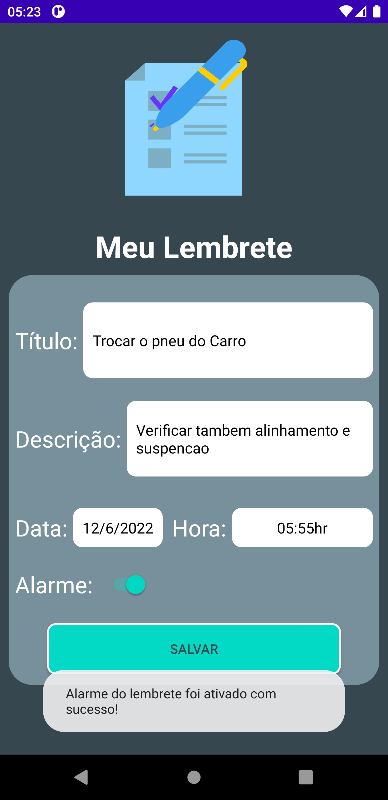
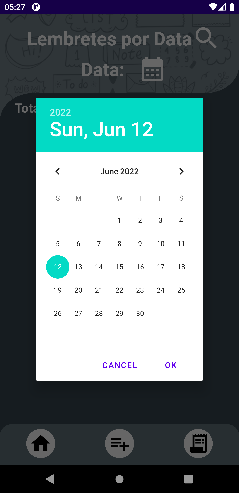

# bancoDadosRoom
Aplicativo do tipo “To Do List” para armazenar as informações dos Lembretes em um banco de dados utilizando a linguagem Kotlin.

Linguagem Kotlin utilizando:
- Aplicação da Arquitetura MVVM ao projeto utilizando viewModels, Courotines e Flow;
- Banco de Dados com a biblioteca ROOM para armazenar as informações dos Lembretes(titulo, descrição, data, horário, alarme on/off);
- Animações utilizando a biblioteca Lottie;
- Utilização de BroadcastReceiver() para setar e resetar alarmes para os lembretes;
- Notificação para disparo de Alarme quando chegar o horário da Tarefa do Lembrete;
- Utilização de Alarme sonoro e vibração para o alarme das Tarefas;

O Banco de dados implementado ao aplicativo possui as seguintes funções: 
 1. inserir itens, 
 2. listar itens, 
 3. filtrar dados por data, 
 4. contar itens do banco de dados, 
 5. update de valores de itens, 
 6. deletar item,
 7. deletar todos itens;

## TELA DE MENU PRINCIPAL

## TELA DE ADICIONAR LEMBRETE

## TELA DE EDITAR LEMBRETE

## TELA DE LEMBRETES DO DIA ATUAL

## TELA DE PESQUISA DE LEMBRETES POR DATA

## TELA DE CONFIRMAÇÃO PARA EXCLUIR UM LEMBRETE

## TELA DE CONFIRMAÇÃO PARA EXCLUIR TODOS OS LEMBRETES

## TELA DE NOTIFICAÇÃO DE ATIVAÇÃO DO ALARME DO LEMBRETE

