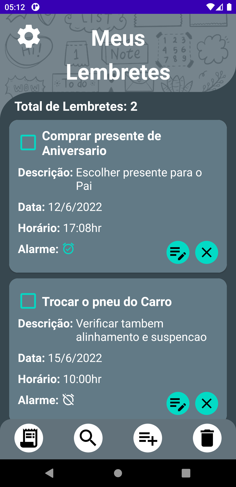

# bancoDadosRoom
Aplicativo para a prática da linguagem Kotlin utilizando Banco de Dados com a Biblioteca ROOM.

Linguagem Kotlin utilizando:
- Aplicação da Arquiteura MVVM ao projeto utilizando viewModels, Courotines e Flow;
- Banco de Dados com a biblioteca ROOM para armazenar as informações dos Lembretes;
- Animações utilizando a biblioteca Lottie;

## TELA DE MENU PRINCIPAL

## TELA DE ADICIONA LEMBRETE

